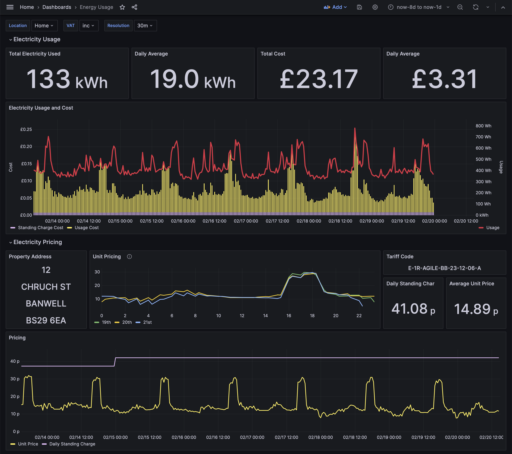
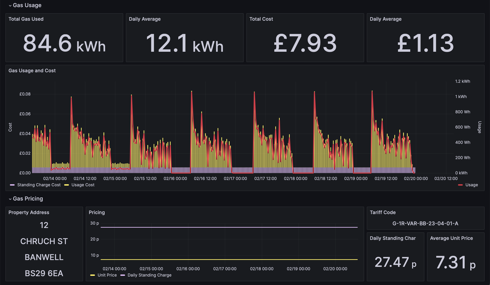

# Octograph

Python tool for downloading energy consumption data from the
_Octopus Energy API_ and loading it into _InfluxDB_.

If you think you'd find this useful, but haven't switched to Octopus yet, then
you can follow my referrer link _https://share.octopus.energy/wind-gecko-169_.
You'll receive a £50 bill credit, and so will I :-D

Thanks to [stevenewey/octograph](https://github.com/stevenewey/octograph) for inspiration for this project,
though there is very little left from the original codebase.




## Docker Compose Quick Start

You can get started with docker compose to give you an InfluxDB server and Grafana instance:

```shell
docker-compose up -d
```

Create your own copy of the config file, and replace your `account_number` as appropriate:
```shell
cp octograph.example.ini octograph.home.ini
```

Run the ingestion, back-filling from the beginning of 2024:

```shell
docker run --rm --name octograph --network octograph \
  -v "$PWD/octograph.home.ini":/etc/octograph.ini:ro \
  -e OCTOGRAPH_INFLUXDB_TOKEN="secret_admin_token" \
  -e OCTOGRAPH_OCTOPUS_API_KEY="sk_live_..." \
  yansonb/octograph:latest \
  --config-file=/etc/octograph.ini \
  --from-date=2024-01-01
```

Open the Grafana UI and login with the user / pass `admin` / `admin`.
* http://localhost:13000/

There will be one dashboard automatically installed called _"Energy Metrics"_.

## Usage

This project can be run directly or from the published Docker image.
If you want to run the code locally, see [Developer set-up](#developer-set-up) below.

The default configuration requires two secrets pass through environment variables:

* `OCTOGRAPH_INFLUXDB_TOKEN`: The InfluxDB token for writing metrics (note, this must have `read` and `write` scope).
* `OCTOGRAPH_OCTOPUS_API_KEY`: Your Octopus API key found in your [account developer settings](https://octopus.energy/dashboard/new/accounts/personal-details/api-access).

Assuming you want to use all other default configuration values, the only other required config to set is your Octopus **account number**.
See [below](#configuration) for a full list of configuration options.
[docker-compose.yml](docker-compose.yml)
### Command-line options

The application takes three command-line options:

| Option          | Description                                                                                            | Default         |
|-----------------|--------------------------------------------------------------------------------------------------------|-----------------|
| `--config-file` | File to load the configuration from                                                                    | `octograph.ini` |
| `--from-date`   | Date to collect fill data from in the format `YYY-MM-DD` or the special values `latest` or `yesterday` | `latest`        |
| `--to-date`     | Date to collect data to in the format `YYY-MM-DD` or the special values `yesterday` or `tomorrow`      | `tomorrow`      |

As this project was primarily built to query Agile rates - which fluctuate, and the pricing for which is published in advance - the default collection period is up to "tomorrow".
If you are not on an agile tariff, you should use a `--to-date` of `yesterday` (consumption is not realtime and will only be available at some point the next day).

In the event consumption data for your meter is not yet available when the program is run, it can "catch up" on missing data by using the `--from-date=latest` option.
This will look back to see when the last datapoints is available from the last 30 days and query for new consumption (and pricing) from then.
NOTE: You must back-fill some data from a fixed date before using the `latest` option. 

### Back-filling

You can populate the metrics with all historic data in your account by specifying a `--from-date` equal to when your account was opened.

From then-on, you can use the defaults `--from-date=latest` and `--to-date=tomorrow` to collect fresh data on a daily basis.

### Scheduling jobs

Consumption data for your meters will be available, usually, at some point in the day following the consumption. 
Hence, you should run the ingestion a couple of times with the configuration `--from-date=latest --to-date=yesterday` to collect yesterday's data.
If you are on an agile tariff, you might prefer to specify `--to-date=tomorrow` to get pricing data covering today and tomorrow (tomorrow's data is usually available at around 5pm).

## Configuration

| Section    | Option                     | Description                                                                                                                       | Default                                             |
|------------|----------------------------|-----------------------------------------------------------------------------------------------------------------------------------|-----------------------------------------------------|
| `influxdb` | `url`                      | InfluxDB connection URL                                                                                                           | `http://localhost:8086`                             |
|            | `org`                      | Influx organisation to use                                                                                                        | `primary`                                           |
|            | `bucket`                   | Influx bucket to store the metrics in                                                                                             | `primary`                                           |
|            | `token_env_var`            | Environment variable to lookup to find InfluxDB authentication token                                                              | `OCTOGRAPH_INFLUXDB_TOKEN`                          |
|            | `included_tags`            | Tags to add to the InfluxDB data points based on account and meter information (see [below](#available-tags) for list of options) | _None_                                              |
|            | `additional_tags`          | Comma-separated key=value list of tags to add to the InfluxDB data points (specify a `location` tag to use the sample dashboard)  | _None_                                              |
| `octopus`  | `account_number`           | Octopus account number (something like `A-XXXXXXXX`)                                                                              |                                                     |
|            | `timezone`                 | Timezone to work in when converting dates and times (see timezone information [below](#timezone-information)                      | `Europe/London`                                     |
|            | `payment_method`           | Pricing to select when there is more than one payment option for an agreement                                                     | `DIRECT_DEBIT`                                      |
|            | `unit_rate_low_start`      | Hour of day (`0-23`) when "night" rate starts (if you have an Economy 7 meter)                                                    | `1`                                                 |
|            | `unit_rate_low_end`        | Hour of day (`0-23`) when "night" rate ends                                                                                       | `8`                                                 |
|            | `gas_meter_types`          | Comma-separated key=value list of meter types where key is the meter serial number and value is the type (`SMETS1` or `SMETS2`)   | `SMETS1` is assumed when serial number is not found |
|            | `volume_correction_factor` | Volume correction factor for `SMETS2` meters which need to be converted from cubic meters to kWh                                  | `1.02264`                                           |
|            | `calorific_value`          | Calorific value for `SMETS2` meter unit conversion to kWh                                                                         | `38.8`                                              |
|            | `resolution_minutes`       | Resolution of data to query and store                                                                                             | `30`                                                |
|            | `api_prefix`               | Octopus API URI prefix                                                                                                            | `https://api.octopus.energy/v1`                     |
|            | `api_key_env_var`          | Environment variable to lookup to find the Octopus API key                                                                        | `OCTOGRAPH_OCTOPUS_API_KEY`                         |
|            | `enable_cache`             | Cache results from the Octopus API on the local filesystem (useful for development)                                               | `/tmp/octopus_api_cache`                            |
|            | `cache_dir`                | Directory to store API responses in for caching purposes (if enabled)                                                             | `false`                                             |
|            | `included_meters`          | Comma-separated list of meter serial numbers to include (useful when some meters in your account are not active)                  | All meters found in your account if not provided    |

### Available Tags

Tags can be added to the InfluxDB data points based on the account, meter and agreement information looked up.

* `account_number`: Account number, as specified by `octopus.account_number`
* `property_address_line_1`: Property information returned by the Octopus API
* `property_address_line_2`
* `property_address_line_3`
* `property_town`
* `property_postcode`
* `electricity_mpan`: Electricity meter point administration number
* `gas_mprn`: Gas meter point reference number
* `meter_serial_number`: Serial number of the electricity or gas meter
* `agreement_tariff_code`: Electricity or gas tariff code applicable at the time of the consumption

To include all tags, you can use the setting:

```text
account_number,property_address_line_1,property_address_line_2,property_address_line_3,property_town,property_postcode,electricity_mpan,gas_mprn,meter_serial_number,agreement_tariff_code
```

### Additional Tags

If you want to use the sample dashboard, you will need to include a `location` tag through the `influxdb.additional_tags` config. For example:

```text
additional_tags = location=Home
```

If your account has more than one property, you can either run separate ingestions with different additional tags filter based on `octopus.included_meters`,
or use `influxdb.included_tags` to include some of the property address information and add additional filters to the dashboard.

## Timezone Information

To align with information available from the API, inputs and requests are made aligned to days according to the timezone provided.
This is also used to calculate the relevant price when a day/night meter and tariff is being used.

## Developer set-up

* Create and activate a virtual environment, e.g. `python3 -m venv venv` ([docs](https://docs.python.org/3/library/venv.html))
* `python -m pip install --upgrade pip poetry`
* `poetry install`

### Run unit tests

* `poetry run pytest -v tests`

### Run app locally

* Create a valid config file
* Set environment variables containing credentials (`OCTOGRAPH_INFLUXDB_TOKEN` and `OCTOGRAPH_OCTOPUS_API_KEY`)
* Run `python app/octopus_to_influxdb.py --config-file=octograph.ini`

### Build docker image locally

* `docker build --build-arg VERSION=$(git rev-parse --short HEAD) -t octograph:dev .`

### Run docker image locally

Create a config file (see the [docker-compose quick start](#docker-compose-quick-start)).

```shell
OCTOGRAPH_INFLUXDB_TOKEN="..."
OCTOGRAPH_OCTOPUS_API_KEY="..."
docker run --rm --name octograph \
  -v "$PWD/octograph.home.ini":/etc/octograph.ini:ro \
  -e OCTOGRAPH_INFLUXDB_TOKEN="$OCTOGRAPH_INFLUXDB_TOKEN" \
  -e OCTOGRAPH_OCTOPUS_API_KEY="$OCTOGRAPH_OCTOPUS_API_KEY" \
  octograph:dev \
  --config-file=/etc/octograph.ini
```

If you are using docker-compose with the example config, add the `--network octograph` option.

If you have not built the image locally, change the image and tag to one from [Docker Hub](https://hub.docker.com/repository/docker/yansonb/octograph), e.g. `yansonb/octograph:latest`.

## Known Issues

* Import meters have not been tested and are not supported.
* The cubic meter to kWh conversion used fixed values whereas they actually fluctuate (see link below).

## Links

* [Octopus Energy API](https://developer.octopus.energy/docs/api/)
* [InfluxDB](https://docs.influxdata.com/influxdb/v2/) | [Docker Image](https://hub.docker.com/_/influxdb)
* [Grafana](https://grafana.com/docs/grafana/latest/) | [Docker Image](https://hub.docker.com/r/grafana/grafana)
* [Octograph Docker Image](https://hub.docker.com/repository/docker/yansonb/octograph/general)
* [Calorific value](https://www.nationalgas.com/data-and-operations/calorific-value-cv)
* _[Guide to the Octopus API](https://www.guylipman.com/octopus/api_guide.html)_