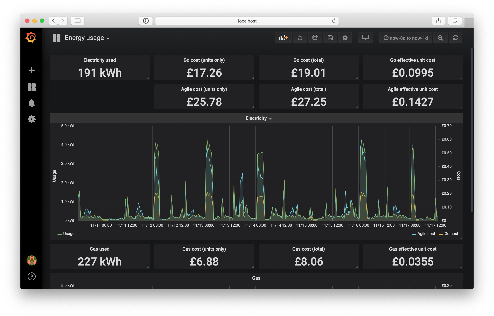

Octograph
---------

Python tool for downloading energy consumption data from the
`Octopus Energy API`_ and loading it into `InfluxDB`_.

If you think you'd find this useful, but haven't switched to Octopus yet, then
you can follow my referrer link `<https://share.octopus.energy/vivid-emu-468>`_
and you'll receive a £50 bill credit, and so will I :)

In the process, additional metrics will be generated and stored for unit rates
and costs as configured by the user. Suitable for two-rate electricity tariffs
like `Octopus Energy Go`_. Single rate gas readings are also retrieved and
stored.

The secondary unit rate is specified with start and end times, and a timezone
which is useful for the Go tariff where the discount rate changes with
daylight savings time.

Included is an example `Grafana`_ dashboard to visualise the captured data.

An example Docker Compose file is included for easily running InfluxDB and
Grafana.

Installation
============

Tested on macOS with Docker for Mac and Python 3.6. A Python virtualenv is
recommended.

Install the Python requirements with ``pip``

.. code:: bash

    pip install -r app/requirements.txt

Usage
=====

Create a configuration file ``octograph.ini`` customised with your Octopus
API key, meter details and energy rate information. This file should be in the
working directory where you run the ``octopus_to_influxdb.py`` command, or
can be passed as an argument.

.. code:: bash

    python app/octopus_to_influxdb.py --help

By default, energy data for the previous day will be collected. Optional from
and to ranges may be specified to retrieve larger datasets. It is anticipated
that the script will be run daily by a cron job.

.. code:: bash

    docker-compose up -d  # start InfluxDB and Grafana in Docker
    python app/octopus_to_influxdb.py --from-date=2018-10-20
    open http://localhost:3000

The default login credentials for Grafana are admin/admin, and you will be
prompted to set a new password on first login. You should then proceed to add
InfluxDB as a datasource with URL ``http://influxdb:8086`` and database
``energy`` if using the Docker version provided. The dashboard provided can
then be imported to review the data.

.. _Octopus Energy API: https://developer.octopus.energy/docs/api/
.. _Octopus Energy Go: https://octopus.energy/go/
.. _InfluxDB: https://www.influxdata.com/time-series-platform/influxdb/
.. _Grafana: https://grafana.com
